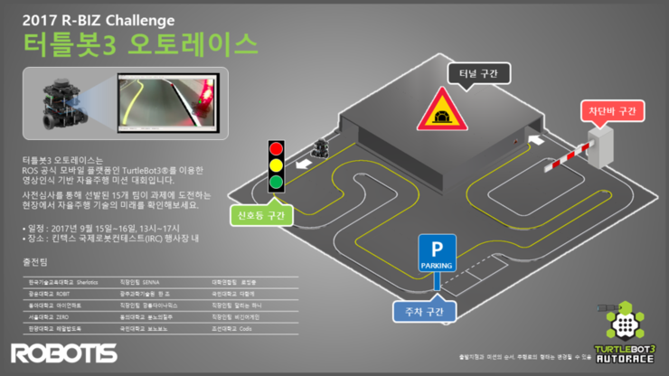
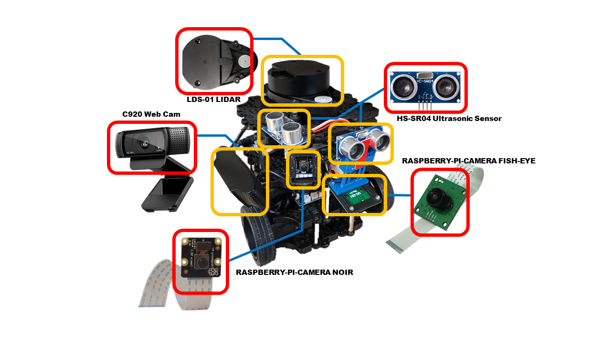
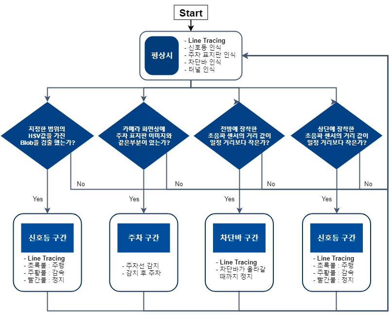
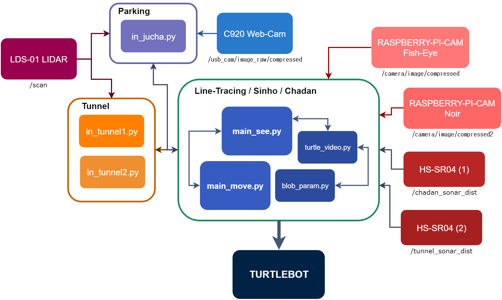

# R-BIZ Challenge TURTLEBOT3 AUTORACE / Realricethief Winning-Code

팀명: 레알밥도둑 / 
로봇명: 간장게장

 <수제 팀로고>

조원 : [이도규](https://github.com/ldkl123), [정민재](https://github.com/mj585), [정현철](https://github.com/junghyeonchiul), [조민수](https://github.com/KoG-8)

연락처 : 정민재(010-3833-5688), 이도규(010-2818-6732), 정현철(010-9162-2075)

## 목차
1. 개요

2. 주행 알고리즘

3. 알고리즘 설명
***
***

## 1. 개요
**1.1. 터틀봇3 오토레이스란**

+ 제공받은 플랫폼인 TURTLEBOT3를 이용하여 ROS기반 자율주행 알고리즘 개발
+ 다양한 센서 활용해 로봇이 도로 환경에서 마주칠수 있는 상황에 대처할 수 있도록 프로그래밍

**1.2. 주요 미션 구간**

+ 신호등 구간: 빨강, 주황, 초록 삼색의 불빛에 따라 정지, 감속, 주행
+ 주차 구간: 주차 표지판 이후에 나오는 주차 공간에 장애물을 피하여 주차
+ 차단바 구간: 주행중에 차단바가 내려오면 정지, 차단 바가 올라가면 다시 주행
+ 터널: 내부의 장애물 배치를 모른 상태로 터널을 들어간 뒤 자율적으로 탈출

**1.3. 사용 센서**

+ 기존 TURTLEBOT3에 첨부된 Lidar이외에 별도의 센서들 장착
+ 라인트레이싱 사용 센서: Raspberry-Pi-Cam Fish-Eye
+ 신호등 구간 사용 센서: Rasberry-Pi-Cam Noir
+ 주차 구간 사용 센서: Rasberry-Pi-Cam Noir, C920 Web Cam 
+ 차단바 구간 사용 센서: HS-SR04 Ultrasonic Sensor
+ 터널 구간 사용 센서: HS-SR04 Ultrasoni Sensor, LDS-01 Lidar

***
***
## 2. 주행 알고리즘
**2.1. 전체 알고리즘 개략도**

+ 로봇 구동시 라인트레이싱 / **각 미션의 시작을 알리는 Flag 탐색 시작**
+ **신호등 구간의 Flag**: 지정한 범위의 HSV값을 갖는 Blob
+ **주차 구간의 Flag**: 좌측면에 장착된 파이캠 Image의 ROI(Region of Interest)내에서 주차 표지판 이미지와 겹치는 부분
+ **차단바 구간의 Flag**: 전방에 장착된 초음파 센서가 감지하는 20cm 이하의 값
+ **터널 구간의 Flag**: 상단에 장착된 초음파 센서가 감지하는 15cm 이하의 값

**2.2. 센서와 노드간 토픽 통신 개략도**

+ 센서들은 각자 정해진 topic이름으로 자신이 감지하는 data를 발행
+ topic으로 발행되는 data들을 처리하여 각 미션을 통과하는 ROS_node를 만듦 
+ TURTLEBOT은 /cmd_vel topic을 이용하여 속도로 제어

***
***
## 3. 알고리즘 설명
**3.1. 라인트레이싱 (main_move.py / turtle_video.py)**

+ 라인트레이싱에 사용되는 Fisheye Image는 시야각이 넓은 대신 왜곡이 매우 심하여 Line검출이 어려움 
+ 따라서 왜곡을 보정해주는 작업이 필요
***
~~~
	np_arr = np.fromstring(ros_data.data, np.uint8)
	image_np = cv2.imdecode(np_arr, cv2.IMREAD_COLOR)

	K = np.array([[  220,     0.  ,  320],
              	      [    0. ,   200,   240],
              	      [    0. ,   0.  ,  1. ]])
	# zero distortion coefficients work well for this image
	D = np.array([0., 0., 0., 0.])

	# use Knew to scale the output
	Knew = K.copy()
	Knew[(0,1), (0,1)] = 0.5 * Knew[(0,1), (0,1)]
	img_undistorted = cv2.fisheye.undistortImage(image_np, K, D=D, Knew=Knew)
~~~

+ Camera Matrix를 이용하여 왜곡을 보정한 모습
***
~~~
gray=cv2.cvtColor(frame,cv2.COLOR_BGR2GRAY) ### Process image to make finding line easy
ROI=gray[350:,140:500]
ROI=cv2.GaussianBlur(ROI,(7,7),0)
thr=cv2.adaptiveThreshold(ROI,255,cv2.ADAPTIVE_THRESH_GAUSSIAN_C,cv2.THRESH_BINARY,11,2)
blur=cv2.medianBlur(thr,9)	
edge=cv2.Canny(blur,180,360)
~~~
+ 왜곡을 보정한 Image를 각종 Blur, Thresholding, Canny_Edge 처리
***
~~~
	left_edge=edge[:,:edge.shape[1]/2] ### in left side, it finds only '/'type when jucha stage
	right_edge=edge[:,edge.shape[1]/2:] ### in right side, it finds only '\'type when jucha stage
	L_lines=cv2.HoughLines(left_edge,1,np.pi/180,30)
	R_lines=cv2.HoughLines(right_edge,1,np.pi/180,30)
~~~

+ HoughLines함수를 통해 도로에 표시된 직선을 검출
***
~~~
	lineL=[] ### value initializing
	lineR=[]
	L=0	
	R=0
	i=0
	Ldegree=0
	Rdegree=0

	if R_lines is not None:
		R_lines=[l[0] for l in R_lines]
		for rho,theta in R_lines:
    			a = np.cos(theta)
    			b = np.sin(theta)
    			x0 = a*rho
    			y0 = b*rho
    			x1 = int(x0 + 1000*(-b))
    			y1 = int(y0 + 1000*(a))
    			x2 = int(x0 - 1000*(-b))
    			y2 = int(y0 - 1000*(a))
			degree=np.arctan2(y2-y1,x2-x1)*180/np.pi
			if degree>10 and R==0:
				i+=1
				Rdegree=degree
				R+=2
				cv2.line(frame,(x1+320,y1+160),(x2+320,y2+160),(0,100,100),3)
				break
			else:
				continue
		
	if L_lines is not None:
		L_lines=[l[0] for l in L_lines]
		for rho,theta in L_lines:
    			a = np.cos(theta)
    			b = np.sin(theta)
    			x0 = a*rho
    			y0 = b*rho
    			x1 = int(x0 + 1000*(-b))
    			y1 = int(y0 + 1000*(a))
    			x2 = int(x0 - 1000*(-b))
    			y2 = int(y0 - 1000*(a))
			degree=np.arctan2(y2-y1,x2-x1)*180/np.pi
			if degree<-10 and L==0:	
				i+=1
				Ldegree=degree
				L+=2
				cv2.line(frame,(x1+170,y1+160),(x2+170,y2+160),(0,100,100),3)
				break
			else:
				continue
~~~
~~~
	if i==2:
		return frame,-(Ldegree+Rdegree)*0.05 ### if there are two lines, then angular_vel depends on difference of angle
	elif i==1:
		if Ldegree==0:
			return frame,-(Rdegree-92)*0.04
		else:
			return frame,-(Ldegree+92)*0.04
	else:
		return frame,-0.001
~~~
+ 검출한 직선이 이루는 각도를 구한 뒤 그 값으로 로봇의 속도를 P제어
***

**3.2. 신호등 구간 (main_see.py / turtle_video.py / blob_param.py)**

+ 로봇이 신호등의 초기 상태인 초록 불빛을 발견하면 신호등 구간으로 인식
***
~~~
	np_arr = np.fromstring(ros_data.data, np.uint8)
	image_np = cv2.imdecode(np_arr, cv2.IMREAD_COLOR)

	####<<< DEFINE_ROI >>>####
	blob_ROI=image_np[100:,:]
	parking_ROI=image_np
	
	############################<<< Stage Selecting >>>############################	
	if s_g<2 and stage==100:		
		keypoints_green=turtle_video_siljun.find_color(blob_ROI,lower_green,upper_green,0)
		if keypoints_green:
			stage=0
			print('sinho!')
~~~
~~~
def find_color(frame,lower,upper,stage):  ### Color detecting to find sinho_signal or jucha_sign

	detector = blob_param_siljun.setting(stage)
	hsv = cv2.cvtColor(frame,cv2.COLOR_BGR2HSV) ### process rgb_image to hsv_image 
	mask_red = cv2.inRange(hsv,lower,upper)
	reversmask = 255-mask_red                   ### Detect blobs
	keypoints = detector.detect(reversmask)
	
	if stage==0:
		cv2.imshow('zzz',reversmask)
        
	if len(keypoints)>0 and stage==1:
		point=[]	
		for i in keypoints:
			point.append(i.pt)	
		return point
    
	elif stage==0:	
		return keypoints
    
	#return keypoints ### return whether it finds color
~~~
~~~
def setting(stage):### stage=0 -> shingho , stage=1->parking

	if stage==0: #shinho
		# Setup SimpleBlobDetector parameters.
		params = cv2.SimpleBlobDetector_Params()
		 
		# Change thresholds
		params.minThreshold = 0;
		params.maxThreshold = 256;
		 
		# Filter by Area.
		params.filterByArea = True
		params.minArea = 500
		params.maxArea=2300
		 
		# Filter by Circularity
		params.filterByCircularity = True
		params.minCircularity = 0.4
		 
		# Filter by Convexity
		params.filterByConvexity = True
		params.minConvexity = 0.1
		 
		# Filter by Inertia
		params.filterByInertia = False
		params.minInertiaRatio = 0.01
		 
		# Create a detector with the parameters
		ver = (cv2.__version__).split('.')
		if int(ver[0]) < 3 :
		    detector = cv2.SimpleBlobDetector(params)
		else : 
		    detector = cv2.SimpleBlobDetector_create(params)
		return detector
~~~
+ main_see.py에서 Pi-Cam Noir가 받은 Image를 turtle_video.py의 함수로 처리
+ turtle_video.py에서 blob_param.py에 있는 parameter사용
+ Image에 설정한 크기의 blob을 발견했을 경우 keypoint를 return
*** 

+ Threshold값 이상의 blob이 잡힌 모습
+ TURTLEBOT은 평소 상태(stage = 100)에서 신호등 구간 미션 상태(stage = 0)로 돌입
***
~~~
def shinho(blob_ROI,stage): ### Function that run when stage=0

	global f_r; global s_g; global sinho_state
	
	sinho_state=Int8MultiArray()

	if f_g==1 and f_r==0 and s_g==0:		
		keypoints_red=turtle_video_siljun.find_color(blob_ROI,lower_red,upper_red,stage)  
		print('first green signal detected.')

		if keypoints_red:
			f_r=1
			sinho_state.data=np.array([1,0,1])
			pub_sinho.publish(sinho_state)
		else:
			sinho_state.data=np.array([0,0,0])
			pub_sinho.publish(sinho_state)
		return 0
~~~
+ 신호등 구간 미션 상태일 때 실행되는 코드, 3개의 전역 변수를 이용하여 신호등 구간 미션 진행
+ f_g: 초록 불빛을 처음 감지 시 0 -> 1 / f_r: 붉은 불빛을 처음 감지 시 0 -> 1 / s_g: 두번째로 초록 불빛을 감지 시 0 -> 1
+ 처음 초록 불빛을 감지하여 신호등 구간에 진입하면 붉은 불빛을 발견할 때까지 서행
+ sinho_state = [f_r, s_g, keypoints_red]
***
~~~
	if f_g==1 and f_r==1 and s_g==0:
		keypoints_green=turtle_video_siljun.find_color(blob_ROI,lower_green,upper_green,stage)	
		print('red signal detected. waiting secondary green signal.')

		sinho_state.data=np.array([1,0,0])
		pub_sinho.publish(sinho_state)
		if keypoints_green:						
			s_g=1
			sinho_state.data=np.array([1,1,1])
			pub_sinho.publish(sinho_state)
		return 0
~~~
+ 첫번째 붉은 불빛을 감지했을 때 실행되는 코드
+ 두번째로 초록 불빛을 감지할 때까지 정지
***
~~~
    if f_g == 1 and f_r == 1 and s_g == 1:
        print('second green signal detected.')
        s_g = 2
        sinho_state.data = np.array([1, 2, 0])
        pub_sinho.publish(sinho_state)
        return 100
~~~
+ 두번째로 초록 불빛을 감지했을 때 실행되는 코드
+ 신호등 구간 미션을 완수하고 평상시로 돌아감(stage = 100)
***

**3.3. 주차 구간 (main_see.py / main_move.py / turtle_video.py / blob_param.py / in_jucha.py)**
+ 주차 표지판을 인식할 경우 주차 구간 미션 상태(stage = 1)로 돌입

~~~
###########################<<< Trainnig parking sign >>>##################################

orb = cv2.ORB_create()
bf = cv2.BFMatcher(cv2.NORM_HAMMING, crossCheck=True)

imgTrainColor=cv2.imread('parking.jpg')
imgTrainGray = cv2.cvtColor(imgTrainColor, cv2.COLOR_BGR2GRAY)

kpTrain = orb.detect(imgTrainGray,None)
kpTrain, desTrain = orb.compute(imgTrainGray, kpTrain)

#########################################################################################
~~~
~~~
    if line_count < 3 and stage == 100:
        keypoints_blue = turtle_video_siljun.find_color(parking_ROI, lower_blue, upper_blue, 1)
        if keypoints_blue:
            match_len = turtle_video_siljun.parking_match(keypoints_blue, image_np, orb, bf, desTrain)
            print(match_len)
            if match_len >= 3:
                stage = 1
                print('jucha!')
~~~

+ 주차 표지판에 쓰인 파란색 HSV값 범위의 blob을 감지할 경우 그 blob주변 이미지가 주차 표지판이 맞는지 확인
+ OpenCV의 ORB_create함수를 사용하여 주차 표지판 Image와 카메라 Image를 서로 비교
+ 서로 Matching하여 일정 threshold값 이상이 같으면 주차 표지판이라고 인식
+ 주차 구간 미션 상태 돌입(stage = 1)
***
~~~
def checking_parking_space(ros_data): ### using web_cam, check white_blob and line and enough distance, if all exist, it send Availablity
    
	global white_detected; global park_enable; global d
    	
	np_arr 		= np.fromstring(ros_data.data, np.uint8) ### image process
	frame 		= cv2.imdecode(np_arr, cv2.IMREAD_COLOR)
	hsv 		= cv2.cvtColor(frame,cv2.COLOR_BGR2HSV)
	mask_white 	= cv2.inRange(hsv,lower_white,upper_white)
	res1 		= cv2.bitwise_and(frame,frame,mask=mask_white)

	line 		= turtle_video_siljun.find_line(frame) ### Checking if there are lines
	keypoints 	= turtle_video_siljun.find_white(frame, lower_white, upper_white) ### Checking if there are white
	

	if (line > 0) and keypoints:
		white_detected=1   		### check white line
	else:
		white_detected=0

	n=1
	for i in d:
		if (i > 0.12) and (i < 0.6):
			n = 0					### check parking space
	if n == 0:
		park_enable=0
	else:
		park_enable=1	
~~~
+ 주차 구간 미션 상태에 돌입 시 실행되는 코드
+ 로봇 우측에 장착한 C920 Web-Cam이 받은 Image와 LDS-01 Lidar가 받는 Distance data를 처리하여 주차 가능 여부 판단 
+ C920으로 로봇이 지나친 주차선의 개수 판단(총 3개) / LDS-01로 주차 공간에 장애물이 있는지 판단
+ 주차선을 1개, 2개 지나칠 때 우측 전방에 장애물이 있는지 판단 후 없으면 주차 동작 코드 실행
***
~~~
def jucha(num,angular): ### Function that run when stage=1

	global line_count; global park_count; global lt;
	print(line_count)

	if line_count==0:
		if num[0]==0:
			turtlemove(0.1,angular)
			return 1

		else:
			line_count=1
			return 1

	elif line_count==1:
		if num[0]==1 and lt==0:
			turtlemove(0.1,angular)
			return 1

		elif num[0]==0 and lt==0:
			if num[1]==1:
				turtlemove(0.11,-0.7)
				rospy.sleep(rospy.Duration(2))
				turtlemove(0.1,0)
				rospy.sleep(rospy.Duration(1.7))
				turtlemove(0,0)
				rospy.sleep(time)
				turtlemove(-0.1,0)
				rospy.sleep(rospy.Duration(1.7))
				turtlemove(-0.11,0.7)
				rospy.sleep(rospy.Duration(2))
				turtlemove(0,0)	
				park_count=1
				lt=1
				return 100

			else:
				lt=1
				return 1
			
		else:	
			if angular<1.9:		
				turtlemove(0.09,angular)
			else:
				turtlemove(0.06,0)

			if num[0]==1:				
				line_count=2
				return 1

			return 1

	elif line_count==2:

		if num[0]==1 and lt==1:
			turtlemove(0.09,angular)
			return 1

		elif num[0]==0 and park_count==0 and lt==1:
			turtlemove(0.11,-0.7)
			rospy.sleep(rospy.Duration(2))
			turtlemove(0.1,0)
			rospy.sleep(rospy.Duration(2))
			turtlemove(0,0)
			rospy.sleep(time)
			turtlemove(-0.1,0)
			rospy.sleep(rospy.Duration(2))
			turtlemove(-0.11,0.7)
			rospy.sleep(rospy.Duration(2))
			turtlemove(0,0)
			lt=2
			return 100

		elif park_count==1 and lt==1:
			lt=2
			return 1
		else:
			turtlemove(0.09,angular)

			if num[0]==1:
				line_count=3
				print(line_count)
				return 100

			return 1
~~~
+ line_count : 로봇이 지나친 주차선의 개수
+ 장애물이 없어서 한 번 주차에 성공했다면 평상시(stage = 100)로 돌아와 라인트레이싱
***
